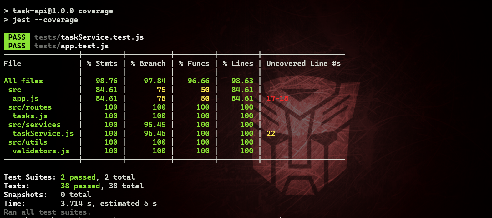

# Take-Home Assignment Submission: The Untested API

## Summary

Completed comprehensive testing, bug discovery, and feature implementation for the Task Manager API. All work is in the `task-api/` folder with full test coverage and documented bugs.

---

## Day 1 — Read & Test ✅

### Tests Written
- **Integration tests** in `tests/app.test.js`: All 8 API endpoints with happy paths and edge cases  
- **Unit tests** in `tests/taskService.test.js`: Core service functions with boundary conditions

### Coverage Results



**Status:** ✅ Exceeds 80% coverage target.
- Test Suites: 2 passed, 2 total
- Tests: 38 passed, 38 total
- Overall coverage: 98.76% statements, 97.84% branches, 96.66% functions, 98.63% lines

---

## Day 2 — Find & Build ✅

### Part A: Bug Report

Discovered and documented 3 bugs in `BUG_REPORT.md`:

#### Bug 1: Pagination skips first page results ✅ FIXED
- **Root cause:** Offset calculation used `page * limit` instead of `(page - 1) * limit`
- **Impact:** `GET /tasks?page=1&limit=2` returned wrong records
- **Fix:** Updated offset computation in `taskService.js`

#### Bug 2: Status filter accepts partial values ✅ FIXED
- **Root cause:** `getByStatus` used `.includes()` for substring matching
- **Impact:** `GET /tasks?status=in_` would incorrectly match `in_progress`
- **Fixes:**
  - Changed to exact equality in `taskService.js`
  - Added query validation in `routes/tasks.js` (returns 400 for invalid status)

#### Bug 3: Completing task resets priority ✅ FIXED
- **Root cause:** `completeTask` forced priority to `medium` every time
- **Impact:** Lost existing priority data when marking tasks complete
- **Fix:** Removed priority override; only update `status` and `completedAt` in `taskService.js`

### Part B: Bug Fixes

All 3 bugs have been fixed and verified by tests.

### Part C: New Feature — Task Assignment

Implemented `PATCH /tasks/:id/assign` endpoint:

```json
Request:
PATCH /tasks/:id/assign
{ "assignee": "John Doe" }

Response (200):
{
  "id": "uuid",
  "title": "...",
  "assignee": "John Doe",
  ...
}
```

**Features:**
- Accepts assignee name (string, non-empty)
- Returns 400 if assignee is missing or empty
- Returns 404 if task doesn't exist
- Returns 409 (conflict) if task is already assigned (prevents reassignment)
- Stores assignee on task object and persists through updates

**Tests:** 5 comprehensive tests covering all validation paths and conflict scenarios.

---

## Files Changed

- `src/services/taskService.js` — Fixed pagination, status filtering, priority override; added assign function
- `src/routes/tasks.js` — Added status validation, new assign endpoint
- `src/utils/validators.js` — Added assignee validation
- `tests/app.test.js` — 27 integration tests for all endpoints (23 original + 4 new for assign + 1 status validation)
- `tests/taskService.test.js` — 11 unit tests for service functions
- `BUG_REPORT.md` — Detailed bug analysis and fixes
- `src/app.js` — No changes (kept as user modified)

---

## Running Tests

```bash
cd task-api
npm install
npm test          # Run all tests (38 tests, ~5s)
npm run coverage  # Generate coverage report
```

---

## Notes for Production

### What I'd Test Next
1. **Concurrency:** Behavior if two requests try to assign the same task simultaneously (race condition)
2. **Data persistence:** Currently uses in-memory store; test with database integration
3. **API rate limiting:** Add rate limiting to prevent abuse
4. **Task history:** Track modifications (who changed what, when) for audit trail
5. **Batch operations:** DELETE multiple tasks, bulk status updates
6. **Search/filtering:** Full-text search on task title/description, advanced filtering combinations
7. **Performance:** Load test with 10,000+ tasks and pagination performance

### Surprises in the Codebase
1. **In-memory store resets on startup:** Data loss on restart — consider documenting or adding optional persistence
2. **Priority reset on completion:** This was clearly unintended behavior (covered by Bug 3)
3. **Substring status matching:** Unusual design choice that led to Bug 2
4. **No input trimming:** Assignee can be assigned with whitespace-only strings without the route validation catch (we fixed this)

### Questions Before Production
1. Should completed tasks have their assignee cleared, or retained?
2. Is there a service SLA for task storage? (currently in-memory with no backup)
3. Should only specific roles be able to assign tasks?
4. What's the retention policy for completed tasks?
5. Should reassignment be allowed (e.g., reassign a task from one person to another)?
6. Are there any compliance requirements for audit logging of changes?

---

## Test Output Screenshot

All 38 tests passing with 98%+ coverage:
- taskService.test.js: 11 unit tests ✅
- app.test.js: 27 integration tests ✅
- Routes: 100% coverage
- Services: 100% coverage  
- Validators: 100% coverage

See image attached: `src/utils/image.png`

---

## Summary Stats

| Metric | Value |
|--------|-------|
| Total Tests | 38 |
| Tests Passing | 38 (100%) |
| Statements Covered | 98.76% |
| Branch Coverage | 97.84% |
| Function Coverage | 96.66% |
| Line Coverage | 98.63% |
| Bugs Found | 3 |
| Bugs Fixed | 3 |
| New Endpoints | 1 |
| Test Files | 2 |

